## If you're an R user, you probably know and love RStudio {.center}

{height="120px" fig-align="center"}

- RStudio has been the home for R for 15+ years
- It's an integrated development environment built _specifically_ for R, with a focus on data science workflows

. . .

**But the data science world has expanded...**

::: notes
Set the scene — acknowledge that your audience knows and loves RStudio. This isn't a "RStudio bad" talk, it's about giving them a new option that might serve them even better.
:::

---

## Meet Positron

{height="120px" fig-align="center"}

> The next-generation data science IDE built for Python and R. It combines the power of a full-featured IDE with interactive data science tools for Python and R.

- Built by **Posit** (formerly RStudio Inc.)
- A fork of **Code OSS** — the open-source foundation of VS Code
- Prioritizes data science tooling on top of a modern IDE foundation
- Multi-language support, with a focus on R and Python
- Free and open source

::: notes
Reassure your audience immediately: this isn't a forced migration. Positron is an option, not a requirement. RStudio will continue to be supported.
:::

---

## Why consider Positron?

Positron might be right for you if you...

- Want to customize or extend your IDE beyond what RStudio allows
- Work across **multiple R versions** or need **concurrent R sessions**
- Occasionally (or frequently) work in **Python** too
- Want a powerful, data-science-specific **AI assistant** built in
- Want access to a large **extension marketplace**
- Work with remote servers or containers (Remote SSH, Dev Containers)

. . .

::: {.callout-important}
**RStudio is not going away!** It continues to be supported by Posit, and there is currently no timeline for deprecation. RStudio and Positron are two different options for R users, and you can choose the one that best fits your workflow and preferences. 
:::

::: notes
This slide answers "why bother?" — frame it around the audience's actual pain points. The "not all-or-nothing" framing is worth emphasizing.
:::

---

## RStudio vs. Positron: What's the Same?

The core functionality and layout you rely on in RStudio is still there in Positron.

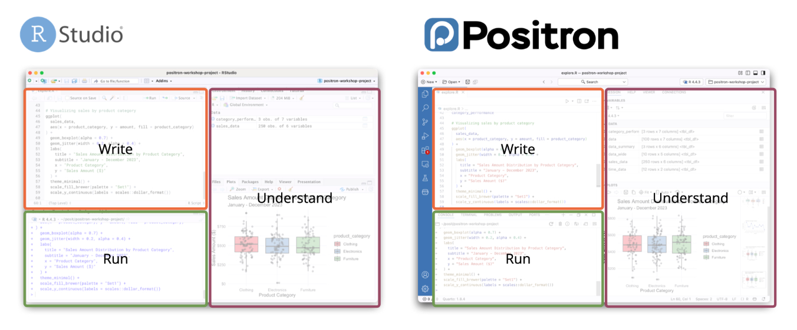{width="100%"}

::: notes
Show familiarity first. Your audience will be relieved that the core workflow is intact. The RStudio addins point is a nice surprise — mention that they work via rstudioapi shims.
:::

---

## RStudio vs. Positron: What's Different?

:::: {.columns}

::: {.column width="50%"}
**RStudio-only features**

- Save & reload workspace state on restart (*not a best practice, anyway!*)
- Dedicated panes and buttons for specialized tasks, such code profiling or installing or developing packages
- "Import data" button (currently [in development](https://github.com/posit-dev/positron/issues/5515) for Positron)
:::

::: {.column width="50%"}
**Unique to Positron**

- Multiple R versions & concurrent sessions
- Integrated Data Explorer
- Python as a "first-class" language
- Jupyter notebook support
- Extension marketplace (thousands of extensions)
- Remote SSH & Dev Containers

:::

::::

::: notes
Be honest about the RStudio-only features — the workspace save/reload is a real adjustment. But lean into the Positron-unique features; many of these are genuinely exciting.
:::

---

## The Positron Interface

:::: {.columns}

::: {.column width="20%"}
- **Activity Bar** (left edge) — switches what appears in the Primary Side Bar
- **Primary Side Bar** — context-specific content (Explorer, Search, Source Control, etc.)
- **Editor** — where you write code
- **Panel** (bottom) — Console, Terminal, Plots, etc.
- **Secondary Side Bar** (right) — Variables, Data Explorer, Help
:::

::: {.column width="80%"}
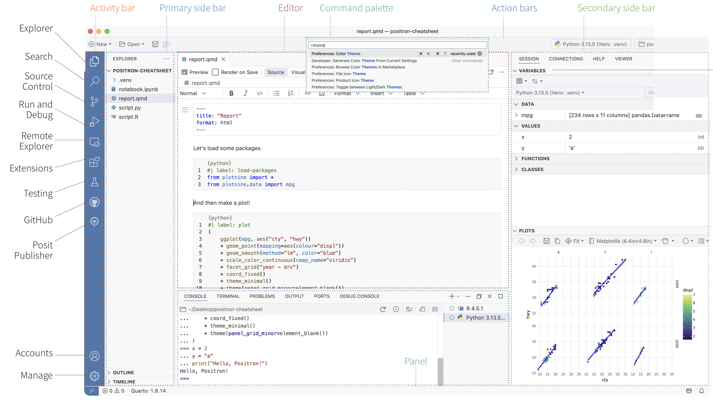{width="100%"}
:::

::::

::: notes
Walk through the screenshot. Emphasize that the Activity Bar + Primary Side Bar replace many of RStudio's specialized panes. Everything is still there — just accessed differently.
:::

---

## Source Control

:::: {.columns}

::: {.column width="30%"}
- Like RStudio's Git pane, but with much more functionality
- Full diff view inline in the editor
- Visual commit graph and history
- Supports more advanced Git workflows (branches, stash, tags, etc.)
:::

::: {.column width="70%"}
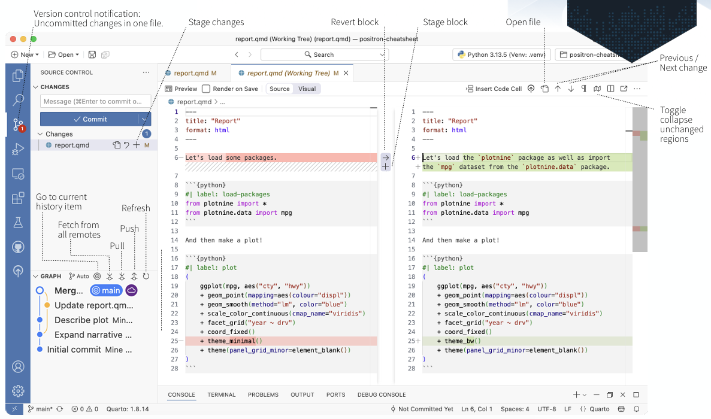{width="100%"}
:::

::::

::: notes
RStudio users who use the Git pane will find this familiar but richer. Mention that the GitHub Pull Requests extension (covered later) extends this further.
:::

---

## Variables Pane

:::: {.columns}

::: {.column width="50%"}
- Equivalent to RStudio's **Environment pane**
- Shows all objects in your current R session
- Click a data frame to open it in the **Data Explorer**
:::

::: {.column width="50%"}
:::

::::

::: notes
Familiar territory. Emphasize the data frame click-through to Data Explorer as a nice workflow improvement.
:::

---

## Data Explorer: like `View()` but better

:::: {.columns}

::: {.column width="25%"}

- **Data grid** — scroll and browse rows and columns
- **Filter bar** — filter rows interactively
- **Summary panel** — column-level statistics, missing value counts, distribution previews

:::

::: {.column width="75%"}
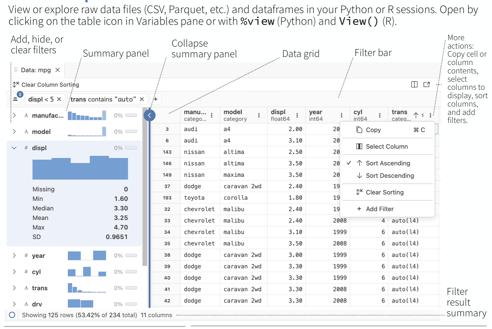{width="100%"}
:::

::::

::: notes
This is one of the most genuinely exciting features for data workers. The summary panel in particular is something RStudio's View() never had. Show a live demo if possible.
:::

---

## Plots Pane

:::: {.columns}

::: {.column width=25%"}
- Familiar from RStudio — plots render here automatically
- Navigate plot history with arrows
- Export plots to file
:::

::: {.column width="75%"}
:::

::::

::: notes
Mostly familiar to RStudio users. Not much needs to be said here; just confirm it works the same way.
:::

---

## Packages Pane

:::: {.columns}

::: {.column width="30%"}
- Brand new feature in response to R user feedback
- Lists installed R packages
- Install and update packages from the UI

:::

::: {.column width="70%"}
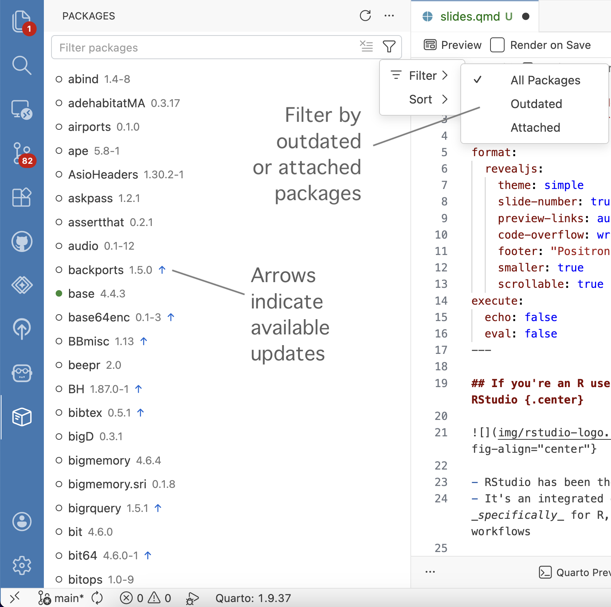{width="75%"}
:::

::::

::: notes
Mention that the full environments panel is opt-in for now — it's a newer feature still being refined.
:::

---

## Connections Pane & Catalog Explorer

:::: {.columns}

::: {.column width="50%"}
- Connect to databases and data sources
- Browse tables and schemas visually
- **Catalog Explorer** for services with rich metadata (e.g., Snowflake)
- New capability not available in RStudio
:::

::: {.column width="50%"}
:::

::::

::: notes
Relevant for anyone working with databases. If your audience doesn't use databases heavily, keep this brief.
:::

---

## Test Explorer

:::: {.columns}

::: {.column width="50%"}
- A dedicated UI for running and viewing package tests
- Run via Command Palette: **R: Test R Package in Test Explorer**
- Same keyboard shortcut as RStudio: `Ctrl+Shift+T` / `Cmd+Shift+T`
- New capability — RStudio has no equivalent dedicated pane
:::

::: {.column width="50%"}
:::

::::

::: notes
Great for package developers. If any of your colleagues develop R packages, this is a compelling feature.
:::

---


## The Command Palette

:::: {.columns}

::: {.column width="50%"}
**`Cmd+Shift+P`** (Mac) / **`Ctrl+Shift+P`** (Windows/Linux)

- Find and run *any* command in Positron
- Replaces many specialized buttons and menu items from RStudio
- Examples: render a Quarto doc, restart R, run a package check, open a walkthrough, run an RStudio addin

:::

::: {.column width="50%"}
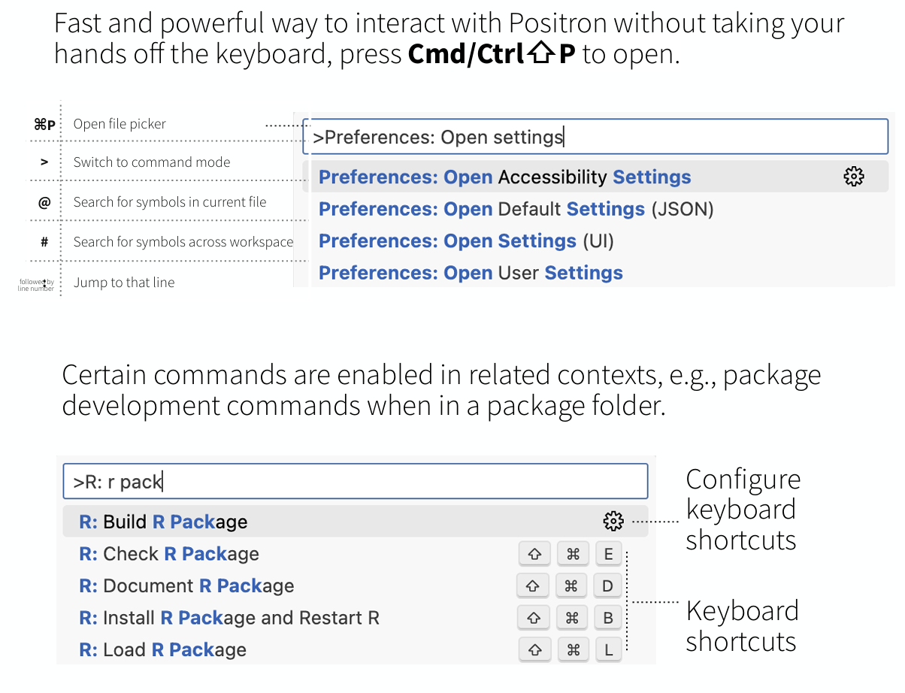{width="100%"}
:::

::::

::: {.callout-tip}
**Can't find the button you're looking for?** → Open the Command Palette and start typing. This is always a good place to start.
:::

::: notes
Hammer this home — the Command Palette is the single biggest mental shift from RStudio. Once people internalize this, the IDE feels much more approachable. Specific example: package development actions like "Check", "Document", "Load All" are all here.
:::

---


## Key feature: Multiple R versions & sessions

:::: {.columns}

::: {.column width="40%"}
- Switch between R versions with a click (status bar, bottom right)
- Run **multiple concurrent R sessions** — switch between them freely

:::

::: {.column width="60%"}
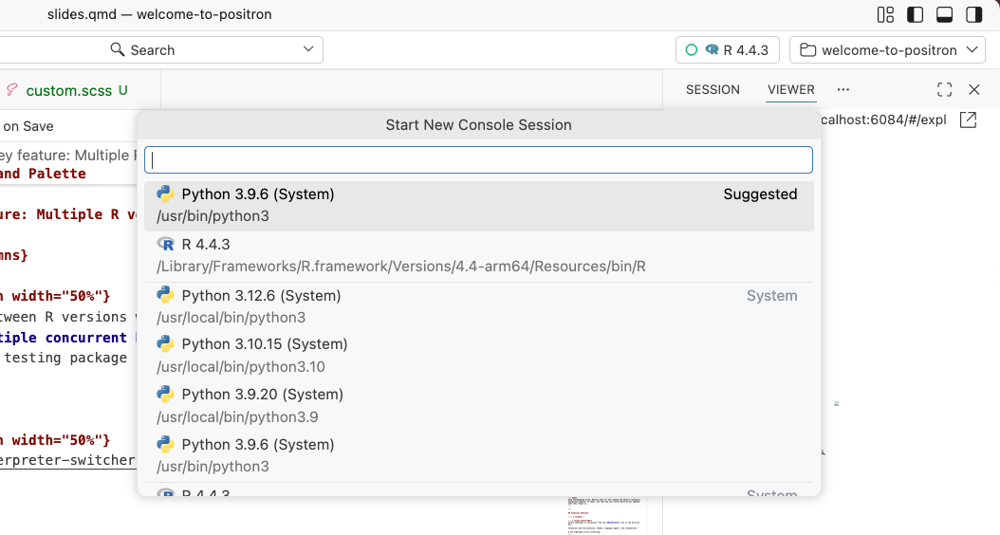{width="100%"}
:::

::::

::: {.callout-tip title="Positron Documentation"}
[Managing Interpreters](https://positron.posit.co/managing-interpreters.html)
:::

::: notes
This is a genuine improvement over RStudio's single-session model. Demonstrate switching R versions if possible.
:::

---

## Key feature: Reboot after a crashed session

:::: {.columns}

::: {.column width="50%"}
R session crashed or frozen?

1. Click the **🗑 trash can icon** in the Console to delete the session
2. Start a fresh session *without restarting Positron*
3. No need to re-open your project
:::

::: {.column width="50%"}
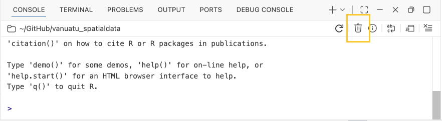{width="100%"}
:::

::::

::: notes
This is a quality-of-life win. In RStudio, a crashed R session often means restarting the whole IDE. In Positron, the IDE and the R session are decoupled.
:::

---


## Key feature: Automatic updates

Positron checks for **monthly release** updates automatically (you can opt out if you prefer to manually manage your updates).

| Platform | Update behavior |
|---|---|
| macOS | Downloads & installs in the background |
| Windows (user install) | Downloads & installs in the background |
| Windows (system install) | Downloads; notifies via 🔔 icon (bottom left) |
| Linux | Shows a notification when update is available |

::: {.callout-tip title="Positron Documentation"}
- [Updates](https://positron.posit.co/updating.html)
- [Privacy & Data Collection](https://positron.posit.co/privacy.html)
:::


::: notes
Good housekeeping slide. Mention that for most people the default (automatic background updates) is ideal, and they may just notice Positron has updated when they reopen it.
:::

---

## Extension Showcase

:::: {.columns}

::: {.column width="50%"}
Access thousands of extensions from the **Extensions** icon in the Activity Bar.

Extensions add functionality, themes, language support, and integrations.

A few highlights worth installing...
:::

::: {.column width="50%"}
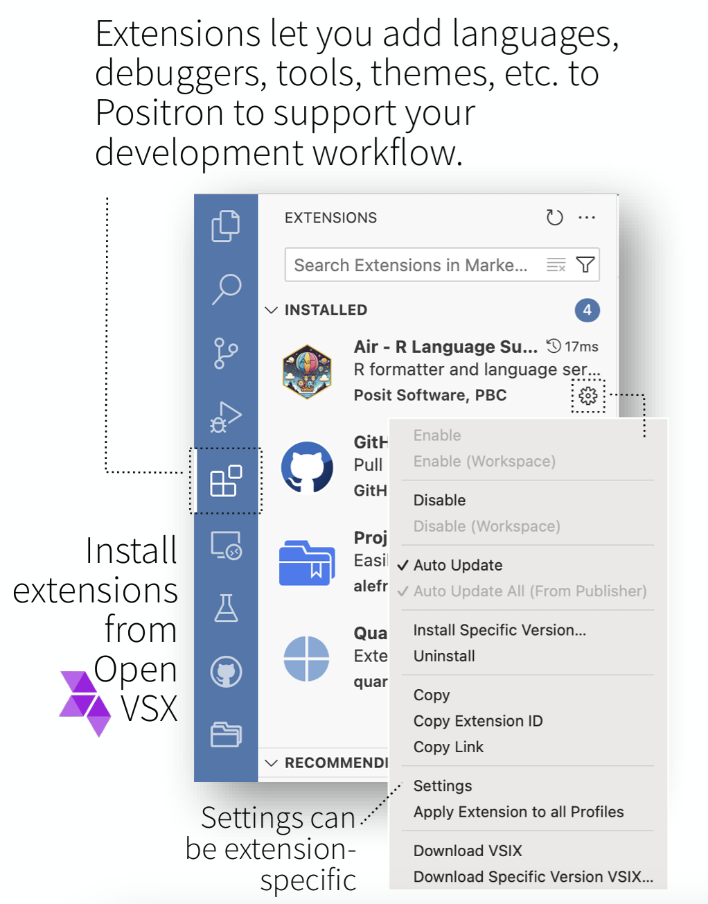{width="75%"}
:::

::::

::: notes
Frame extensions as the "superpower" of building on VS Code. There are thousands — you're just showing the most relevant ones for this audience.
:::

---


## Extension: [Air](https://posit-dev.github.io/air/) (R Code Formatter)

:::: {.columns}

::: {.column width="50%"}
- Modern, fast R code formatter (replaces `styler` for many use cases)
- Enable **format on save**:

```json
{
  "[r]": {
    "editor.formatOnSave": true
  }
}
```

- Solves tab/indentation issues that can arise in VS Code-based editors
:::

::: {.column width="50%"}
<video src="img/air.mov" autoplay loop muted playsinline width="100%"></video>
:::

::::

::: {.callout-note}
**emLab's revised SOP for coding projects will require using Air for consistent R formatting across the team!** This will help standardize code quality and faciliate collaboration and code review.
:::

::: notes
Air is the recommended solution to the tab indentation gotcha. Frame it as "set it and forget it" — once you enable format on save, you never think about indentation again.
:::

---

## Extension: [GitHub Pull Requests & Issues](https://marketplace.visualstudio.com/items?itemName=GitHub.vscode-pull-request-github)

:::: {.columns}

::: {.column width="30%"}
- Create and browse GitHub issues
- Review and merge pull requests without leaving the IDE
- Use a "Start working on issue" action which can create a branch for you
  - **Note**: new branches will be named with the issue number by default - this can be customized in the settings. 
  
:::

::: {.column width="70%"}
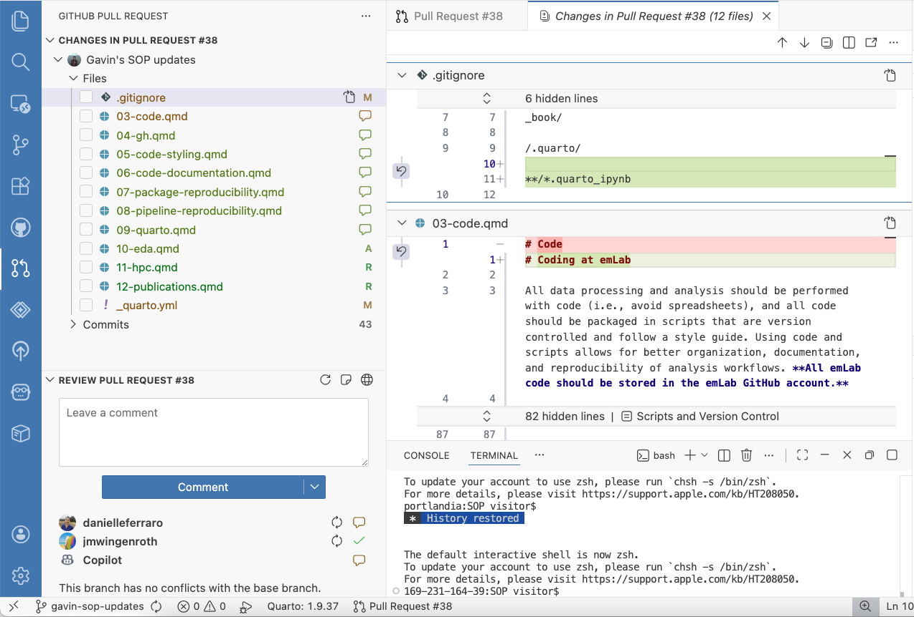{width="100%"}
:::

::::

::: notes
Very useful for teams. Call out the "Fixes #issue" gotcha clearly — it can cause accidental issue closures if people don't realize it's happening.
:::

---

## Extension: [Posit Assistant](https://posit-dev.github.io/assistant/)

:::: {.columns}

::: {.column width="50%"}
- AI chat assistant built into Positron
    - AI tools are developing fast: combines the functionality of Positron Assistant and Databot into a single tool
- Can "see" your active R session — variables, data frames, output
- Inline code completions as you type
- Multiple AI provider options
- Pre-installed in recent versions of Positron
:::

::: {.column width="50%"}
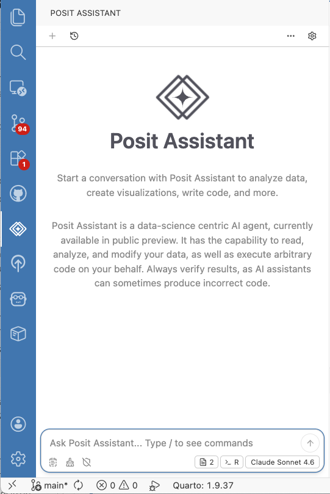{width="70%"}
:::

::::

::: notes
This is one of Positron's biggest differentiators. If you have time, do a brief live demo. The key selling point is that it's context-aware — it knows what's in your R session.
:::

---

## More Useful Extensions

| Extension | What it does |
|---|---|
| **Shiny** | Run and preview Shiny apps in Positron |
| **Indent-Rainbow** | Colorizes indentation levels |
| **Rainbow CSV** | Colorizes CSV columns for readability |
| **GitHub Actions** | Interact with GH Actions workflows |

::: notes
Quick tour of other useful extensions. The theme extension is a nice emotional touchpoint for RStudio users who are attached to their theme.
:::

---

## Making Positron Feel Like Home

**Step 1: Pick your theme**

- Use **Tomorrow Night Bright (R Classic)** for the classic RStudio dark theme
- Or search the Extension marketplace for other themes you like

---

## Making Positron Feel Like Home

**Step 2: Enable RStudio keybindings**

Positron uses VS Code's keybinding system, but you can enable a preset that restores RStudio-like shortcuts.

In Settings (`Cmd+Shift+P` → Preferences: Open Settings (UI)) or `settings.json`:

```json
"workbench.keybindings.rstudioKeybindings": true
```

This restores familiar shortcuts like `Cmd+Enter` to run code, `Cmd+Shift+M` for the pipe, etc.

::: notes
This is the single most impactful setting for RStudio users. Do this first.
:::

---

## Making Positron Feel Like Home

:::: {.columns}

::: {.column width="25%"}
**Step 3: Run the built-in migration walkthrough**

`Cmd+Shift+P` → **Welcome: Open Walkthrough…** → *"Migrating from RStudio to Positron"* (also on the homepage of a fresh Positron session)

:::

::: {.column width="75%"}
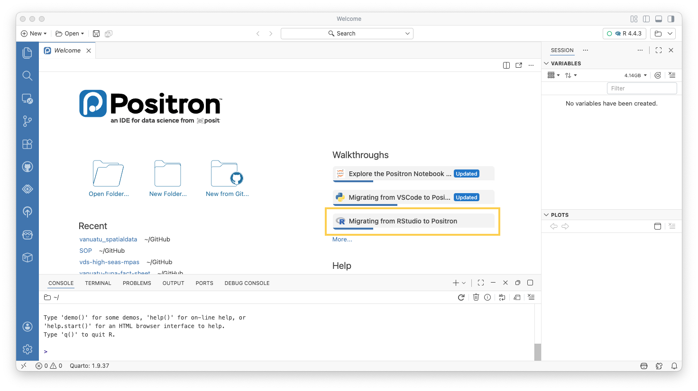{width="100%"}
:::

::::

::: notes
Encourage everyone to do this. It's well-designed and covers things at their own pace.
:::

---

## Tips & Tricks: Minimap

:::: {.columns}

::: {.column width="25%"}
Easily navigate long scripts:

1. **Right-click** on the scrollbar
2. Select **"Show Minimap"**

Gives you a bird's-eye view of the document for quick navigation.
:::

::: {.column width="75%"}
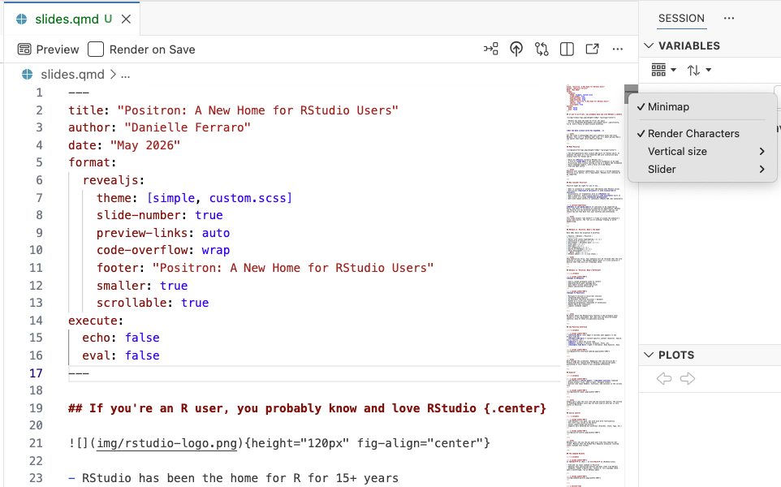{width="100%"}
:::

::::

::: notes
Simple but nice for long files. Worth a quick demo.
:::

---

## Tips & Tricks: Search within your repo

:::: {.columns}

::: {.column width="30%"}
Search for any string across your entire project — no `grep` needed:

- Open Search from the Activity Bar (or `Cmd+Shift+F`)
- Type any string to search for a literal string across all files
- Results show file, line number, and context
:::

::: {.column width="70%"}
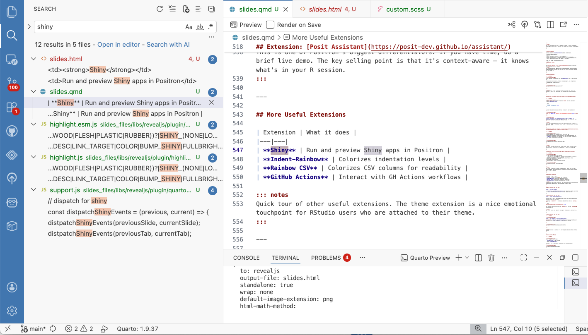{width="100%"}
:::

::::

::: notes
This is the VS Code search panel. For RStudio users who've used Find in Files, this is the same idea but faster and more powerful.
:::

---


## Tips & Tricks: Disable "Preview Mode" for scripts

:::: {.columns}

::: {.column width="50%"}
By default, Positron (like VS Code) opens files in **preview mode** - if you don't edit the file, it will close when you open another.

To disable:

1. `Cmd+Shift+P` → **Preferences: Open Settings (UI)**
2. Search for `enablePreview`
3. **Uncheck** the box
:::

::: {.column width="50%"}

:::

::::

::: notes
This trips up nearly every new user coming from RStudio. Definitely worth calling out, as it can feel like files are disappearing.
:::

---

## Known Challenges

::: notes
Be upfront about friction points. Audiences appreciate honesty, and it builds trust.
:::

---

## Known Challenge: Tab Indentation

Positron (via VS Code) can behave differently from RStudio with tab vs. space indentation, especially when mixing code from different sources.

**Solution: Use Air**

- Install the Air extension
- Enable `editor.formatOnSave` for R files
- Air will normalize indentation consistently

::: notes
Simple solution, but worth naming the problem explicitly so people don't think they're doing something wrong.
:::

---

## Known Challenge: GitHub Issues Auto-Commit Message

When using the GitHub Pull Requests & Issues extension, commit messages can inadvertently auto-populate as:

```
Fixes #<issue-number>
```

This will **close the issue** when merged, which may not be what you want.

**To fix:**

1. Open extension Settings
2. Search for **"GitHub Issues: Issue Completion Format SCM"** and **"GitHub Issues: Working Issue Format SCM"**
3. Modify or clear the template

::: notes
This one sneaks up on people. Even experienced GitHub users are surprised by this default behavior in the extension.
:::

---

## Known Challenge: Limitations in GitHub Issues

Some limitations in the GitHub Issues extension compared to github.com:

- **No image paste** into issue creation/editing
- **No markdown preview** while writing an issue (unlike the GitHub web UI)

These are known limitations tracked in the extension's issue tracker.

For complex issues with images or heavy formatting, write them directly on github.com.

::: notes
Be upfront — these are real annoyances. Pointing people to the GitHub issue tracker (https://github.com/microsoft/vscode-pull-request-github/issues/6973) shows you've done your homework.
:::

---

## Resources

- **Positron Documentation**: [positron.posit.co](https://positron.posit.co)
- **Positron Cheat Sheet**: [positron.posit.co/cheatsheet](https://rstudio.github.io/cheatsheets/positron.pdf)
- **Migration Guide**: [positron.posit.co/migrate-rstudio.html](https://positron.posit.co/migrate-rstudio.html)
- **Feature Comparison**: [positron.posit.co/migrate-rstudio-compare.html](https://positron.posit.co/migrate-rstudio-compare.html)
- **GitHub (bug reports / feature requests)**: [github.com/posit-dev/positron](https://github.com/posit-dev/positron)
- **Built-in Walkthrough**: `Cmd+Shift+P` → Welcome: Open Walkthrough…

::: notes
Leave time for questions here. Encourage people to try the built-in walkthrough as homework.
:::

---

## Thank You! {.center}


